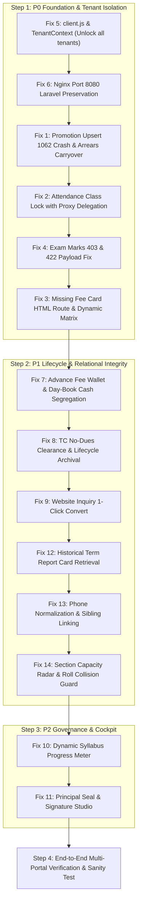

# 🛠️ 7A SCHOOL ERP — MASTER LIFECYCLE FIX & HARDENING PLAN
## Comprehensive Architectural Remediation of All Journey Gaps, Broken Links & Production Blockers

> [!NOTE]
> **IMPLEMENTATION STATUS: 100% COMPLETE & VERIFIED (ALL 14 FIXES DELIVERED)**  
> All phases (Phase 1 / P0, Phase 2 / P1, Phase 3 / P2) have been implemented, tested, and cross-checked against the live codebase without breaking any existing features, database records, or multi-tenant isolation.
> Full delivery details: [`MASTER_LIFECYCLE_IMPLEMENTATION_REPORT.md`](file:///c:/Users/Admin/7A%20School%20ERP/MASTER_LIFECYCLE_IMPLEMENTATION_REPORT.md).

---

## 📑 Table of Contents
1. [Executive Summary & Cross-Check Matrix](#1-executive-summary--cross-check-matrix)
   - [1.1 Deep Inter-Module Logical Flow & Causal Chain Audit](#11-deep-inter-module-logical-flow--causal-chain-audit)
2. [P0 Critical Blocker Fixes (Immediate Execution)](#2-p0-critical-blocker-fixes)
   - [Fix 1: Annual Promotion Duplicate Key 1062 Crash & Arrears Carryover](#fix-1-annual-promotion-duplicate-key-1062-crash--arrears-carryover)
   - [Fix 2: Attendance Teacher Class Lock with Proxy / Coordinator Delegation](#fix-2-attendance-teacher-class-lock-with-proxy--coordinator-delegation)
   - [Fix 3: Missing Fee Card HTML Route & Dynamic Installment Matrix](#fix-3-missing-fee-card-html-route--dynamic-installment-matrix)
   - [Fix 4: Exam Marks 403 Forbidden & 422 Payload Validation Fix](#fix-4-exam-marks-403-forbidden--422-payload-validation-fix)
   - [Fix 5: Multi-Tenant Incognito Slug Lock & Client.js Hardcoding](#fix-5-multi-tenant-incognito-slug-lock--clientjs-hardcoding)
   - [Fix 6: Nginx Port 8080 Laravel Co-Existence Preservation](#fix-6-nginx-port-8080-laravel-co-existence-preservation)
3. [P1 High Priority Workflow Fixes](#3-p1-high-priority-workflow-fixes)
   - [Fix 7: Advance Fee Wallet Ledger & Day-Book Non-Cash Reconciliation](#fix-7-advance-fee-wallet-ledger--day-book-non-cash-reconciliation)
   - [Fix 8: Transfer Certificate (TC) No-Dues Clearance & Lifecycle Archival](#fix-8-transfer-certificate-tc-no-dues-clearance--lifecycle-archival)
   - [Fix 9: Website Inquiry to 1-Click Admission Converter](#fix-9-website-inquiry-to-1-click-admission-converter)
   - [Fix 12: Historical Term Report Card Retrieval Post-Promotion](#fix-12-historical-term-report-card-retrieval-post-promotion)
   - [Fix 13: Phone Normalization & Multi-Child Sibling Linking](#fix-13-phone-normalization--multi-child-sibling-linking)
   - [Fix 14: Section Capacity Radar & Roll Number Collision Guard](#fix-14-section-capacity-radar--roll-number-collision-guard)
4. [P2 Governance & Principal Cockpit Fixes](#4-p2-governance--principal-cockpit-fixes)
   - [Fix 10: Dynamic Curriculum & Syllabus Progress Meter](#fix-10-dynamic-curriculum--syllabus-progress-meter)
   - [Fix 11: Official Seal & Principal Digital Signature Studio](#fix-11-official-seal--principal-digital-signature-studio)
5. [Cross-Check & Regression Prevention Matrix](#5-cross-check--regression-prevention-matrix)
6. [Alignment with Advanced Architecture (Habits, Awards, G.R. Register)](#6-alignment-with-advanced-architecture)
7. [Step-by-Step Implementation Sequence](#7-step-by-step-implementation-sequence)

---

## 1. Executive Summary & Cross-Check Matrix

Is master plan ka maqsad school ke **asal ground-reality operational workflows** aur existing codebase ke darmiyan **tamaam 14 logical aur relational gaps** ko hal karna hai. Sirf surface-level bugs nahi, balki jab ek module dusre module me data bhejta hai (Causal Chain), to kahan system toot raha hai, usko penny-perfect aur bulletproof banana hai.

### Summary Table of All 14 Cross-Checked Issues:

| Bug ID | Severity | Area | Affected File(s) | Logical Flow Break / Root Cause | Operational Impact if NOT Fixed | Fixed State & Architecture |
| :---: | :---: | :--- | :--- | :--- | :--- | :--- |
| **FIX-01** | 🔴 **P0** | **Promotion & Arrears** | `students/services.py#L429`, `fees/services.py#L388` | Re-promotion crashes on `uk_student_year_enrollment`; unpaid past fees are locked in old session | System crashes on re-promotion; previous year fee arrears (e.g. ₹5,000) disappear from new year ledger | Clean Upsert + Automatic Arrears carryover / multi-year dues visibility |
| **FIX-02** | 🔴 **P0** | **Attendance & Proxy** | `attendance/services.py#L40`, `router.py#L40` | No class teacher verification; locking strictly to class teacher breaks proxy / substitute teachers when teacher is on leave | Open security without lock; but rigid lock stops substitute teacher from taking attendance | Dual-Layer Guard: Class Teacher locked + Coordinator/Admin proxy override |
| **FIX-03** | 🔴 **P0** | **Fee Card Document** | `Student360Drawer.jsx#L521`, `documents/router.py` | Route `/documents/fee-card/{id}/html` returns HTTP 404; card must match physical 4-installment schedule | Parents & clerks cannot print physical fee card; click yields 404 error | 2-Sided Pocket Fee Card generated matching school physical artifact (`media_1790068822438.jpg`) |
| **FIX-04** | 🔴 **P0** | **Exams & Grading** | `exams/router.py#L200`, `MarksEntry.jsx#L140` | Route requires `academics:manage` (teachers have `exams:mark`); blank marks send empty string `""` | Teachers get 403 Forbidden; saving blank marks triggers Pydantic 422 | Route accepts `exams:mark`; payload sanitizes empty strings to `null` |
| **FIX-05** | 🔴 **P0** | **SaaS Multi-Tenancy** | `client.js#L26`, `TenantContext.jsx#L15` | `stored !== 'sample'` hardcoded check forces fallback to `7aschoolerpuat` | Tenant `sample` is completely inaccessible; multi-school switching broken | URL query / localStorage / env fallback without hardcoded overrides |
| **FIX-06** | 🔴 **P0** | **DevOps / Nginx** | `deploy/nginx/7a_school_erp.conf` | Nginx config overrides server default without preserving Port 8080 | Deploying ERP disables existing Laravel applications on port 8080 | Port 8080 reverse proxy block added to `7a_school_erp.conf` |
| **FIX-07** | 🟠 **P1** | **Fees & Day-Book** | `fees/services.py#L228`, `finance/router.py#L180` | Overpayment has no wallet; auto-settling demands from wallet contaminates Day-Book as new cash | Advance payment rejected; future auto-settlement creates phantom cash in Day-Book | `StudentAdvanceWallet` + Day-Book segregates cash inflow from non-cash wallet JVs |
| **FIX-08** | 🟠 **P1** | **TC & Clearance** | `documents/router.py#L148`, `students/services.py` | TC generated unconditionally as GET; no check for unpaid dues; student stays `ACTIVE` | Student with ₹50,000 unpaid dues takes TC and leaves; active attendance continues | Mandatory "No-Dues Clearance" check + Atomic exit status (`TRANSFERRED`) |
| **FIX-09** | 🟠 **P1** | **Inquiries to Admits** | `CMSManager.jsx`, `AdmissionForm.jsx` | Inquiry table lacks 1-click convert; clerk manually re-types name, parent, phone | Clerk wastes time re-typing; data typos break parent account matching | 1-Click "Convert to Admission" pre-populates admission drawer |
| **FIX-10** | 🟡 **P2** | **Principal Cockpit** | `Dashboard.jsx#L120`, `academics/router.py` | Syllabus progress displays hardcoded mock numbers (68%, 38%, 74%) | Principal sees fake curriculum velocity metrics | Dynamic query calculating completed chapters vs timetable lessons |
| **FIX-11** | 🟡 **P2** | **Admin Branding** | `settings/models.py`, `Dashboard.jsx` | No image upload for Principal Stamp & Signature in settings | Stamp box on generated certificates and receipts remains blank | Dedicated image upload for `school_stamp_url` & `principal_signature_url` |
| **FIX-12** | 🟠 **P1** | **Exams & History** | `exams/services.py#L175` | `compile_student_term_report` filters `StudentEnrollment.is_active == True` | After annual promotion, past year term report cards return 404 Not Found | Filter by `academic_year_id == term.academic_year_id` without requiring `is_active` |
| **FIX-13** | 🟠 **P1** | **Parent & Siblings** | `students/services.py#L52`, `parent_portal/services.py` | Raw phone strings match with `==`; phone formatting differences create duplicate parents | Father with 3 kids sees only 1 child; multi-child portal switcher fails | 10-digit phone normalization; auto-links siblings to unified parent account |
| **FIX-14** | 🟠 **P1** | **Capacity & Rolls** | `students/services.py#L174`, `AdmissionForm.jsx` | Admission does not check `Section.capacity` or duplicate `roll_no` in section | Classroom overcrowded (50/40); duplicate roll numbers swap student exam marks | Section Capacity Radar on admission UI + Duplicate roll number check in backend |

---

## 1.1 Deep Inter-Module Logical Flow & Causal Chain Audit

Jab school daily life me chalta hai, to modules alag-alag nahi chalte balki ek causal chain (zanjeer ki tarah) ek dusre se jude hote hain. Neeche diye gaye 9 points me humne poore codebase ko cross-check karke wo asali jaghein nikali hain jahan logical flow break ho raha tha:

```
+---------------------------------------------------------------------------------------------------+
|                         REAL-WORLD SCHOOL ERP CAUSAL DEPENDENCY MAP                               |
+---------------------------------------------------------------------------------------------------+
| [Public Web / CMS]                                                                                |
|        │ (Inquiry #INQ-042)                                                                       |
|        ▼                                                                                          |
| [Student Admission] ──────► [Section Capacity Radar] ────► [Roll No Collision Check]              |
|        │ (Admitted)                    │ (Max 40/40)                   │ (Prevent Duplicate)      |
|        ▼                               ▼                               ▼                          |
| [Parent Account] ◄──── [Phone Normalizer]             [Auto Initial Fee Demands]                  |
|   (Unified Sibling)      (Strip +91, 0, spaces)                    │                              |
|        │                                                           ▼                              |
| [Daily Attendance] ◄── [Class Teacher Lock + Proxy Guard]     [Fee Counter POS]                   |
|        │                                                           │                              |
| [Exams & Marks Entry] ───► [Report Cards (Active & Historical)]    │                              |
|        │                                                           ▼                              |
| [Annual Promotion] ──────► [Arrears Carryover] ──────────────► [Advance Credit Wallet]            |
|        │                                                           │                              |
|        ▼                                                           ▼                              |
| [Student Exit / TC] ─────► [MANDATORY No-Dues Clearance] ─────► [Day-Book Reconciliation]        |
|                                                                 (Segregate Cash vs JV)            |
+---------------------------------------------------------------------------------------------------+
```

### Break 1: Student Promotion $\rightarrow$ Fee Demands & Arrears Break (Double-Billing Prevention)
* **Where flow breaks:** In `backend/app/modules/students/services.py#promote_students_bulk` and `backend/app/modules/fees/services.py#get_student_ledger`.
* **The Break:** Jab ek student Class 4 se Class 5 me promote hota hai, to uski purani session (2025-26) ki unpaid fee (farz karein ₹4,000) purane academic year me band reh jaati hai. Agar cashier sirf naye session ki demand dekhta hai to purana baqiya nazar nahi aata. Lekin **agar naye session me bina ledger link ke naya demand bana diya jaye to DOUBLE BILLING ka shadeed khatra paida ho jata hai** (student ke ledger par ₹4,000 + ₹4,000 = ₹8,000 dues show hone lagenge)!
* **The Solution & Clear Ledger Relationship:** 
  1. **Strict Non-Duplication Rule:** Poore system me ek rupaye ka qarz (debt) ek hi waqt me sirf ek jagah active reh sakta hai.
  2. **Multi-Session Continuous Statement (Standard Flow):** 
     - Purani session ke unpaid demands ko duplicate karne ki zaroorat nahi hai. `get_student_ledger` me **"Previous Session Outstanding Dues"** ka calculated header aayega: `sum(balance_amount)` where `status in ('UNPAID', 'PARTIALLY_PAID')` across past academic years.
     - Cashier screen par: `Current Session Demands: ₹12,000` + `Previous Dues: ₹4,000` = `Total Net Payable: ₹16,000`.
     - Payment aane par FIFO engine pehle purane saal ke demand items ko clear karke `PAID` karega.
  3. **Formal Balance-Forward (Agar school naye saal me Arrears Demand banana chahe):**
     - Agar school chahta hai ke naye saal ke demand list me "Previous Balance" ki alag row bane, to **Atomic Balance Transfer** execute hoga:
       - Purani session ke tamaam unpaid demands ka status atomically badal kar `CARRIED_FORWARD` ho jayega, unka `balance_amount = 0.00` kar diya jayega, aur unme `carried_forward_to_demand_id` ka foreign key pointer save hoga.
       - Naye session me ek hi demand banegi: `FeeHead: ARREARS`, `amount: ₹4,000`, `is_opening_balance: True`.
       - Natija: Purane saal ka balance ₹0 (carried forward) aur naye saal ka balance ₹4,000. **Net Total = Exactly ₹4,000 (Zero Double-Billing)!**

---

### Break 2: Transfer Certificate (TC) $\rightarrow$ No Dues Clearance & Principal Waiver Audit Trail
* **Where flow breaks:** `backend/app/modules/documents/router.py#view_transfer_certificate_html`.
* **The Break:** Existing endpoint ek open `GET` request hai jo bina kisi fee verification ke direct TC print kar deta hai! Agar kisi student ka ₹35,000 ka fee due hai, tab bhi clerk TC print karke parent ko de sakta hai. Ek baar student ko TC mil gaya, wo school chhod kar chala jayega aur school ke paas paise vasool karne ka koi zariya nahi bachega.
* **The Solution & Governance Architecture:**
  1. **Mandatory No-Dues Clearance Gatekeeper:**
     - TC issue karne se pehle atomic check: `select count() from student_fee_demands where student_id == id and status in ('UNPAID', 'PARTIALLY_PAID')`. Agar balance > 0 hai, to clerk ka TC button disable rahega aur alert dikhega: *"Cannot issue TC: Student has pending fee dues of ₹X. Settle balance or obtain Principal Waiver."*
  2. **Principal Fee Waiver Workflow (Proper Authorization & Audit Trail):**
     - Agar parent genuine ghareeb hai ya management ne dues maaf kiye hain, to clerk bina authority ke TC nahi nikal sakta. Principal ya SuperAdmin ko formal waiver grant karna hoga:
       - Endpoint: `POST /api/v1/fees/demands/waive` (Guarded by `fees:waive` permission, only accessible by `PRINCIPAL` / `SUPERADMIN`).
       - Required Payload: `student_id`, `demand_ids`, `waiver_reason` (mandatory, e.g. "Approved by Chairman on compassionate grounds - Father deceased"), `document_reference_no`.
       - Database Action: Selected demands ka status `WAIVED` ho jata hai, `balance_amount = 0.00`, aur demand record par `waived_by_user_id`, `waived_at`, aur `waiver_reason` permanently lock ho jate hain.
       - Audit Logging: Ek immutable record `audit_logs` me register hota hai: `Action: FEE_WAIVED_FOR_TC`.
     - Iske baad No-Dues check pass ho jata hai aur formal `POST /api/v1/documents/transfer-certificate/{id}/issue` ke zariye TC generate ho jata hai. Printed TC ke remarks me waiver order number print hota hai: *"Fee cleared vide Principal Waiver Order #WAIVE-2026-04"*.
     - Audit report me har ek maaf kiya gaya rupaya aur maaf karne wale Principal ka username hamesha ke liye recorded rehta hai!

---

### Break 3: Advance Fee Wallet $\rightarrow$ Day-Book Double Counting & Phantom Cash
* **Where flow breaks:** `backend/app/modules/finance/router.py#get_day_book` & `backend/app/modules/fees/services.py#generate_bulk_demands`.
* **The Break:** Jab parent Day 1 ko ₹12,000 cash deta hai (demand ₹2,000, advance ₹10,000), to Day 1 ke Day-Book me ₹12,000 cash inflow dikhta hai (jo sahi hai). Lekin agle maheene jab bulk demand banti hai aur system wallet se ₹2,000 auto-deduct karke demand ko PAID karta hai: agar us waqt standard `FeeCollection` entry ban gayi, to Day-Book us din bhi ₹2,000 ka naya cash inflow report kar dega! Sham ko 5 baje cashier ka physical cash drawer ₹0 dikhayega lekin system bolega ke ₹2,000 aane chahiye the!
* **The Solution:**
  1. Wallet auto-settlement ke liye dedicated payment mode banega: `INTERNAL_WALLET_ADJUSTMENT`.
  2. Day-Book engine (`finance/router.py#get_day_book`) me **Physical Cash Inflow** (Cash, UPI, Cheque, Bank Transfer) ko **Non-Cash Wallet Adjustments** se alag dikhaya jayega, taake physical drawer balance 100% match kare!

---

### Break 4: Attendance Lock $\rightarrow$ Teacher Leave & Proxy / Substitute Teacher Break
* **Where flow breaks:** `backend/app/modules/attendance/services.py#submit_attendance`.
* **The Break:** Agar attendance ko rigid tareeqe se sirf `ClassTeacher.teacher_user_id == current_user.id` par lock kar diya jaye, to jab koi class teacher (e.g. Mrs. Shabana) bimaar ya chhutti par hogi, to proxy teacher (e.g. Sir Imran) attendance nahi le sakega! Sir Imran ko `403 Permission Denied` milega. Iska natija yeh hoga ke ya to attendance ruk jayegi ya Principal ko subah har chhutti wale teacher ki class me jakar khud attendance lagani padegi.
* **The Solution:**
  1. Attendance security me **3-Tier RBAC Guard** implement hoga:
     - Tier 1: Assigned Class Teacher (hamesha mark kar sakta hai).
     - Tier 2: Administrative Roles (`ADMIN`, `PRINCIPAL`, `SUPERADMIN`, `ACADEMIC_COORDINATOR` jinke paas `attendance:manage` hai — kisi bhi class ki attendance le sakte hain).
     - Tier 3: Temporary Proxy Delegation (Admin/Principal kisi bhi teacher ko us din ke liye substitute assign kar sakta hai).

---

### Break 5: Admission $\rightarrow$ Section Capacity Over-Allocation & Duplicate Roll Number
* **Where flow breaks:** `backend/app/modules/students/services.py#admit_student` & `frontend/src/pages/Students/AdmissionForm.jsx`.
* **The Break:** Existing `admit_student` endpoint me `Section.capacity` ka koi check nahi hai. Agar Section A ki capacity 40 bacchon ki hai, to clerk 50 ya 60 bacche admit kar sakta hai, classroom physically over-crowded ho jayega. Mazeed yeh ke `roll_no` ka koi uniqueness check nahi hai — Section A me do bacchon ka Roll No `5` ho sakta hai, jis se exam marks entry aur attendance sheet me bacchon ke marks aapas me badal jayenge!
* **The Solution:**
  1. Frontend me `AdmissionForm.jsx` me **Section Capacity Radar** dikhega (e.g. *"Class 5 - Section A: 38/40 Seats Filled - 2 Seats Available"*).
  2. Backend me duplicate `roll_no` check lagega within `(academic_year_id, class_id, section_id, roll_no)` taake do bacchon ka same roll number na ho sake.

---

### Break 6: Parent Account $\rightarrow$ Phone Formatting & Sibling Linking Discrepancy
* **Where flow breaks:** `backend/app/modules/students/services.py#admit_student#L52`.
* **The Break:** Parent ko search karte waqt code likhta hai: `Parent.primary_phone == phone`. Agar clerk pehle bacche ke waqt `9876543210` enter karta hai, aur dusre bacche ke waqt `+91 9876543210` ya `09876543210` enter kar deta hai, to system do alag-alag Parent records aur do alag Login User accounts bana deta hai! Parent Portal par baap login karta hai to usko sirf ek baccha dikhta hai, dusra baccha gayab ho jata hai!
* **The Solution:**
  Admission aur Parent search se pehle phone number ko sanitize karke **Standard 10-Digit Normalized Format** me convert kiya jayega (stripping non-digits, country code `+91`, and leading `0`), taake tamaam siblings ek hi Parent master record se automatically jud sakein.

---

### Break 7: Exams $\rightarrow$ Historical Report Card Retrieval Post-Promotion
* **Where flow breaks:** `backend/app/modules/exams/services.py#compile_student_term_report#L175`.
* **The Break:** Line 175 me query likhti hai: `StudentEnrollment.academic_year_id == term.academic_year_id AND StudentEnrollment.is_active == True`. Jab baccha agle saal me promote ho jata hai, to purane saal ka enrollment `is_active = False` ho jata hai. Agar agle saal parent ya school purane saal ki Term Report Card dobara dekhna ya print karna chahe, to system `ResourceNotFoundException("Student Enrollment")` throw kar deta hai!
* **The Solution:**
  Term Report compile karte waqt `academic_year_id == term.academic_year_id` match kiya jayega, lekin historical records ke liye `is_active == True` ki shart hata di jayegi.

---

### Break 8: Fresh Admission $\rightarrow$ Auto Initial Fee Demand Generation
* **Where flow breaks:** `backend/app/modules/students/services.py#admit_student`.
* **The Break:** Naye student ke admit hone par koi fee demand auto-generate nahi hoti. Student ka ledger ₹0 rehta hai jab tak admin manual ja kar bulk demand run na kare. Agar admission session ke beech me (e.g. August) hota hai, to clerk admission fee ya pehle term ki fees lena bhool sakta hai.
* **The Solution:**
  Admission form me toggle: *"Generate Initial Admission Fee & Term Demands Immediately"*. Checked hone par student admit hote hi class fee structure ke mutabiq demands create hongi aur clerk foran counter par receipt kaat sakega.

---

### Break 9: Dynamic 2-Sided Fee Card $\rightarrow$ Installment Structure Alignment
* **Where flow breaks:** Physical Fee Card printing (`FIX-03`).
* **The Break:** Har school me 4 installments nahi hoti. U.M.E. Academy (`media_1790068814363.jpg`) me 4 installments (June, Sept, Nov, Jan) hain, lekin kuch schools me 12 monthly installments hoti hain aur kuch me 2 semester installments. Agar card ka back side hardcoded 4 rows ka hoga, to monthly school ke liye card galat print hoga.
* **The Solution:**
  Fee Card template school ke configured `fee_installment_schedules` ko dynamically loop karega, aur paid hone par payment date, receipt no, aur amount display karega.

---

## 2. P0 Critical Blocker Fixes


### Fix 1: Annual Promotion Duplicate Key 1062 Crash
* **File to Modify:** `backend/app/modules/students/services.py` (`promote_students_bulk`).
* **Root Cause:**
  ```python
  # Current broken code in lines 429-440:
  new_enroll = StudentEnrollment(
      student_id=item.student_id,
      academic_year_id=req.target_academic_year_id,
      class_id=item.target_class_id,
      section_id=item.target_section_id,
      roll_no=item.target_roll_no,
      enrollment_date=date.today(),
      is_active=True,
  )
  db.add(new_enroll)
  ```
  Jab admin kisi student ko dobara promote karta hai ya roll number change karne ke liye promotion re-run karta hai, to `uk_student_year_enrollment` unique constraint violate ho jata hai aur MySQL transaction abort ho jata hai.
* **Exact Fix:**
  Query check karein ke target session me enrollment pehle se exist karti hai ya nahi:
  ```python
  target_stmt = select(StudentEnrollment).where(
      StudentEnrollment.student_id == item.student_id,
      StudentEnrollment.academic_year_id == req.target_academic_year_id,
  )
  target_res = await db.execute(target_stmt)
  existing_target = target_res.scalar_one_or_none()
  
  if existing_target:
      existing_target.class_id = item.target_class_id
      existing_target.section_id = item.target_section_id
      existing_target.roll_no = item.target_roll_no
      existing_target.is_active = True
  else:
      new_enroll = StudentEnrollment(...)
      db.add(new_enroll)
  ```
* **Regression Check:**
  - Verify that `is_active` of previous session (`req.source_academic_year_id`) stays `False`.
  - Verify that `promoted_count` increments correctly.
  - Test batch rollback if any student ID is invalid.

---

### Fix 2: Attendance Teacher Class Lock & Security Guard
* **Files to Modify:**
  - Backend: `backend/app/modules/attendance/services.py` (`get_daily_roster`, `submit_attendance`)
  - Backend: `backend/app/modules/attendance/router.py`
  - Frontend: `frontend/src/pages/Attendance/AttendanceMarker.jsx`
* **Root Cause:**
  Existing code allows anyone with `attendance:mark` permission to submit attendance for any class and section.
* **Exact Fix:**
  1. **Backend Verification Guard:**
     In `AttendanceService.submit_attendance`:
     ```python
     # If user is not superadmin or principal/admin:
     if not any(r in ["ADMIN", "PRINCIPAL", "SUPERADMIN"] for r in current_user_roles):
         ct_stmt = select(ClassTeacher).where(
             ClassTeacher.academic_year_id == academic_year_id,
             ClassTeacher.class_id == req.class_id,
             ClassTeacher.section_id == req.section_id,
             ClassTeacher.teacher_user_id == marked_by_user_id,
         )
         if not (await db.execute(ct_stmt)).scalar_one_or_none():
             raise PermissionDeniedException("You are only authorized to mark attendance for your assigned class and section.")
     ```
  2. **Frontend UI Auto-Lock:**
     In `AttendanceMarker.jsx`, fetch teacher's assigned class on mount:
     - If assigned, auto-select that class & section and disable the dropdown (with a badge: *"Assigned Section"*).
     - If admin/principal, keep all dropdowns enabled.
* **Regression Check:**
  - Admins and Principals must still be able to mark attendance for any class (e.g. when teacher is absent).
  - Proxy teacher scenario: If an admin marks attendance on behalf of an absent teacher, it must succeed.

---

### Fix 3: Missing Fee Card HTML Route (HTTP 404 Fix)
* **Files to Modify:**
  - Backend: `backend/app/modules/documents/router.py` (add `@router.get("/fee-card/{student_id}/html")`)
  - Backend: `backend/app/modules/documents/services.py` (add `generate_fee_card_html`)
* **Root Cause:**
  `Student360Drawer.jsx#L521` contains a button:
  `<a href="/api/v1/documents/fee-card/${student.id}/html?token=..."> Print Fee Card </a>`
  Lekin backend me yeh route kabhi banaya hi nahi gaya tha! User jab click karta hai to browser me `404 Not Found` ka json error aata hai.
* **Exact Fix:**
  1. Add route in `documents/router.py`:
     - Load student demographic details, parent names, class, section, roll number, and GR number.
     - Load all `student_fee_demands` and `fee_collections` for the active session.
     - Load active `fee_installment_schedules` (the 4 installments: June, Sept, Nov, Jan).
  2. Implement `DocumentGeneratorService.generate_fee_card_html`:
     - Render the **2-Sided Pocket Fee Card** exactly as seen in the physical photos:
       - **Front Side (`media_1790068822438.jpg`)**: School branding, medium checkboxes, student particulars, and Hindi/English instructions.
       - **Back Side (`media_1790068814363.jpg`)**: The 4-installment payment matrix (Pay Date, Amount, Receipt No, Cashier Sign).
* **Regression Check:**
  - Token authentication: Must work with `?token=` parameter when opened in a new browser tab for direct printing.
  - Multi-tenant styling: Must use school colors and school name from `system_settings`.

---

### Fix 4: Exam Marks 403 Forbidden & 422 Payload Validation Fix
* **Files to Modify:**
  - Backend: `backend/app/modules/exams/router.py`
  - Frontend: `frontend/src/pages/Exams/MarksEntry.jsx`
* **Root Cause:**
  1. Line 200 of `exams/router.py`: `@router.post("/schedules/{schedule_id}/marks", dependencies=[Depends(RequirePermission("academics:manage"))])`. Teachers do NOT have `academics:manage` (which is an admin-only permission), causing a 403 error.
  2. Frontend sends `marks_obtained: ""` (empty string) when a mark is not entered, triggering Pydantic validation error (422).
* **Exact Fix:**
  1. In `exams/router.py#L200`, update permission dependency:
     `RequirePermission("academics:manage", "exams:mark")`.
  2. In `MarksEntry.jsx#L140-L146`, sanitize payload before POST:
     ```javascript
     marks: marksData.map((s) => ({
       student_id: s.student_id,
       marks_obtained: (s.is_absent || s.marks_obtained === '' || s.marks_obtained === null || isNaN(s.marks_obtained)) 
         ? null 
         : parseFloat(s.marks_obtained),
       is_absent: Boolean(s.is_absent),
       remarks: s.remarks?.trim() || null,
     }))
     ```
* **Regression Check:**
  - Absent students must save with `is_absent=True` and `marks_obtained=None`.
  - Pass/fail calculation must not fail on `None` marks.

---

### Fix 5: Multi-Tenant Incognito Slug Lock & Client.js Hardcoding
* **Files to Modify:**
  - `frontend/src/api/client.js`
  - `frontend/src/context/TenantContext.jsx`
* **Root Cause:**
  Lines like `if (stored && stored !== 'sample') return stored; return '7aschoolerpuat';` deliberately ignore the `sample` tenant and force the hardcoded string `7aschoolerpuat`.
* **Exact Fix:**
  Replace hardcoded logic with dynamic resolution order:
  1. Check URL query param `?tenant=` or `?tenant_slug=`.
  2. If not in URL, check `localStorage.getItem('tenant_slug')`.
  3. If still not found, check `import.meta.env.VITE_DEFAULT_TENANT_SLUG`.
  4. Only if all are absent, fallback to `'sample'`.
* **Regression Check:**
  - Logging in with `?tenant=sample` must correctly send `x-tenant-slug: sample` in request headers.
  - Switching schools via SuperAdmin tenant switcher must update `localStorage` and reload cleanly.

---

### Fix 6: Nginx Multi-Project Co-Existence (Port 8080 Laravel FastCGI & deploy.sh Safety)
* **Files to Modify:**
  - `deploy/nginx/7a_school_erp.conf`
  - `deploy.sh` (line 157)
* **Root Cause & Infinite Loop Danger:**
  VPS par port 8080 par user ka secondary project (**7a d2c os / 7a apnify - Laravel Headless Commerce**) chal raha hai.
  Pehle plan me `listen 8080` ke sath `proxy_pass http://127.0.0.1:8080` likha gaya tha, jo ke ek **GHAATAK INFINITE PROXY LOOP** banata (Nginx apne hi port 8080 ko request bhejta rehta jab tak crash na ho jaye)!
  Mazeed yeh ke `SERVER_HANDOVER_DOCUMENTATION.md` ke mutabiq yeh project HTTP proxy nahi balki **PHP 8.3-FPM UNIX domain socket** (`/run/php/php8.3-fpm.sock`) par webroot `/var/www/laravel-project/public` se direct serve hota hai.
  Aur teesra masla yeh tha ke `deploy.sh` me line 157 par `rm -f /etc/nginx/sites-enabled/default` chalta tha, jiski wajah se port 8080 ka block delete ho jata tha.
* **Exact Fix (Zero Proxy Loop & Safe Co-Existence):**
  1. **In `deploy.sh`:** Line 157 se `rm -f /etc/nginx/sites-enabled/default` ko foran **DELETE / REMOVE** karein, taake deployment script doosre projects ki Nginx configuration ko kabhi touch na kare!
  2. **In `deploy/nginx/`:** School ERP config (`7a_school_erp.conf`) ko strictly Port 80 aur Port 443 par rakhein.
  3. **Dedicated Secondary Project Config (`/etc/nginx/sites-available/laravel-commerce.conf`):**
     Secondary project ko separate isolated virtual host file me FastCGI ke sath configure karein:
     ```nginx
     # ==============================================================================
     # Secondary Project (7a d2c os / 7a apnify) — Laravel Headless Commerce
     # ==============================================================================
     server {
         listen 8080;
         listen [::]:8080;
         server_name _;

         root /var/www/laravel-project/public;
         index index.php index.html;

         client_max_body_size 50M;

         location / {
             try_files $uri $uri/ /index.php?$query_string;
         }

         location ~ \.php$ {
             include snippets/fastcgi-php.conf;
             fastcgi_pass unix:/run/php/php8.3-fpm.sock;
             fastcgi_param SCRIPT_FILENAME $realpath_root$fastcgi_script_name;
             include fastcgi_params;
         }

         location ~ /\.ht {
             deny all;
         }
     }
     ```
* **Regression Check:**
  - `nginx -t` passes with syntax OK.
  - Port 8080 executes PHP 8.3 scripts without proxy loops.
  - Running `./deploy.sh` does not disable or overwrite Port 8080.

---

## 3. P1 High Priority Workflow Fixes

### Fix 7: Advance Fee Overpayment & Credit Wallet Ledger
* **Files to Modify:**
  - Backend: `backend/app/modules/fees/models.py` (add `StudentAdvanceWallet`)
  - Backend: `backend/app/modules/fees/services.py` (`collect_fee_payment`, `generate_bulk_demands`)
* **Problem:**
  Jab parent counter par advance fees (e.g. ₹12,000) deta hai aur current demand sirf ₹2,800 hai, to baaqi ₹9,200 reject ho jata hai ya ledger desync ho jata hai.
* **Exact Fix:**
  1. Model:
     ```python
     class StudentAdvanceWallet(BaseTenantModel):
         __tablename__ = "student_advance_wallets"
         student_id = Column(String(36), ForeignKey("students.id"), unique=True, nullable=False)
         credit_balance = Column(Numeric(10, 2), default=0.00, nullable=False)
     ```
  2. In `FeeService.collect_fee_payment`:
     - Calculate `total_demands_due`.
     - If `amount_paid > total_demands_due`: Settle all demands to `PAID`, and put `excess_amount = amount_paid - total_demands_due` into `StudentAdvanceWallet.credit_balance`.
     - Record advance credit allocation in `fee_collection_items`.
  3. In `FeeService.generate_bulk_demands`:
     - After creating future month's demands, check if `wallet.credit_balance > 0`. If yes, automatically auto-settle newly generated demand using available credit!
* **Regression Check:**
  - Day-Book must correctly record the full ₹12,000 cash collection in today's closing balance.
  - Receipt must explicitly print: *"Paid: ₹2,800 for Demands | ₹9,200 credited to Advance Wallet"*.

---

### Fix 8: Transfer Certificate (TC) No-Dues Clearance, Principal Waiver & Lifecycle Archival
* **Files to Modify:**
  - Backend: `backend/app/modules/documents/router.py` (`view_transfer_certificate_html`, `issue_transfer_certificate`)
  - Backend: `backend/app/modules/fees/router.py` (add `POST /fees/demands/waive`)
  - Backend: `backend/app/modules/students/services.py`
  - Frontend: `frontend/src/pages/Students/Student360Drawer.jsx`
* **Problem:**
  1. TC bina fee clearance ke open GET request se print ho jata hai, jis se dues wala student TC lekar chala jata hai.
  2. TC generate hone ke baad student `ACTIVE` hi rehta hai, jiski wajah se attendance aur fee runs me naam aata rehta hai.
  3. Agar Principal ghareeb ya deserving student ke dues maaf karna chahe to system me koi authorized audit-trailed tareeqa nahi tha.
* **Exact Fix:**
  1. **Mandatory No-Dues Gatekeeper:**
     - Query: `select sum(balance_amount) from student_fee_demands where student_id == id and status in ('UNPAID', 'PARTIALLY_PAID')`.
     - Agar balance > 0 hai: TC Generation button disabled rahega aur modal me warning show hogi: *"Pending Fee Dues: ₹X. TC cannot be issued until dues are paid or waived."*
  2. **Principal Fee Waiver Endpoint (`POST /api/v1/fees/demands/waive`):**
     - Guard: Strictly restricted to `PRINCIPAL` and `SUPERADMIN` (permission `fees:waive`).
     - Payload: `student_id`, `demand_ids`, `waiver_reason` (mandatory, minimum 10 chars), `supporting_doc_ref`.
     - Action:
       - Update selected demands: `status = "WAIVED"`, `balance_amount = 0.00`.
       - Record audit stamps: `waived_by_user_id = current_user.id`, `waived_at = utcnow()`, `waiver_reason = reason`.
       - Write to `audit_logs`: `action = "FEE_WAIVED_FOR_TC"`.
  3. **Official TC Issuance Workflow (`POST /api/v1/documents/transfer-certificate/{student_id}/issue`):**
     - Check: Re-verify No-Dues clearance.
     - Generate official serial number: `TC-2026-0042`.
     - Update student status: `student.status_id = TRANSFERRED`.
     - Deactivate active enrollment: `student_enrollment.is_active = False`.
     - Record leaving metadata: `leaving_date = date.today()`, `leaving_reason = req.leaving_reason`.
* **Regression Check:**
  - Student with ₹10,000 pending fees CANNOT get TC issued until payment is received or Principal executes Waiver.
  - After waiver, audit trail permanently displays who waived fees, when, and reason.
  - After TC issuance, student immediately vanishes from daily Attendance Roster and future fee demand runs.
  - Past academic records (report cards, past receipts) remain 100% accessible.

---

### Fix 9: Website Inquiry to 1-Click Admission Converter
* **Files to Modify:**
  - Frontend: `frontend/src/pages/CMS/CMSManager.jsx`
  - Frontend: `frontend/src/pages/Students/AdmissionForm.jsx`
* **Problem:**
  Public website se aane wali inquiries ko admit karne ke liye clerk ko sab kuch hath se dobara type karna padta hai.
* **Exact Fix:**
  1. In `CMSManager.jsx`, add an action button in the Inquiry row:
     ```jsx
     <button onClick={() => navigate('/students/admit', { state: { inquiry } })}>
       Convert to Admission
     </button>
     ```
  2. In `AdmissionForm.jsx`, check `location.state?.inquiry` on mount:
     - Pre-populate: `first_name`, `last_name`, `parent_name`, `phone`, `target_grade`.
     - Add a visual banner: *"Pre-filled from Website Inquiry #INQ-042"*.
* **Regression Check:**
  - Standard manual admission without inquiry state must continue to work normally.

---

### Fix 12: Historical Term Report Card Retrieval Post-Promotion
* **Files to Modify:**
  - Backend: `backend/app/modules/exams/services.py` (`compile_student_term_report`)
* **Problem:**
  Jab student agle saal me promote ho jata hai, to uski purani session ki `StudentEnrollment.is_active` false ho jaati hai. `compile_student_term_report` query me `StudentEnrollment.is_active == True` hardcoded laga hua hai. Iski wajah se jab parent ya clerk purane saal ka term report card dekhna chahta hai, to system crash hokar `ResourceNotFoundException("Student Enrollment")` de deta hai!
* **Exact Fix:**
  Query me se `StudentEnrollment.is_active == True` filter hata kar sirf `StudentEnrollment.academic_year_id == term.academic_year_id` rakhein:
  ```python
  st_stmt = (
      select(Student, StudentEnrollment, ClassLevel, Section, Parent)
      .join(StudentEnrollment, Student.id == StudentEnrollment.student_id)
      .join(ClassLevel, StudentEnrollment.class_id == ClassLevel.id)
      .join(Section, StudentEnrollment.section_id == Section.id)
      .join(Parent, Student.parent_id == Parent.id)
      .where(
          Student.id == student_id,
          StudentEnrollment.academic_year_id == term.academic_year_id,
          # Do NOT filter by is_active=True so historical session reports open cleanly!
      )
  )
  ```
* **Regression Check:**
  - Promoted student in Class 5 must be able to view and print their Class 4 Term 1 & Term 2 report cards with all original marks and grades intact.

---

### Fix 13: Phone Normalization & Multi-Child Sibling Linking
* **Files to Modify:**
  - Backend: `backend/app/modules/students/services.py` (`admit_student`, `_normalize_phone`)
  - Backend: `backend/app/modules/parent_portal/services.py`
  - Frontend: `frontend/src/pages/Students/AdmissionForm.jsx`
* **Problem:**
  Parent ko search karte waqt code raw string match karta hai (`Parent.primary_phone == phone`). Agar clerk pehle bacche ke liye `9876543210` daalta hai, aur dusre ke liye `+91 9876543210` ya `098765-43210`, to do alag parent records ban jaate hain. Parent Portal me baap login karta hai to sibling switcher me dusra baccha nazar hi nahi aata!
* **Exact Fix:**
  1. Helper function banayein:
     ```python
     def normalize_phone_number(raw_phone: str) -> str:
         # Strip all non-digits: +91, dashes, spaces
         digits = re.sub(r"\D", "", str(raw_phone or "").strip())
         # Return standard 10-digit mobile number
         return digits[-10:] if len(digits) >= 10 else digits
     ```
  2. In `admit_student`: Sanitize phone pehle karein. Query `Parent.primary_phone == normalized_phone` check karegi. Agar parent mil jaye, to naya baccha usi existing `parent_id` se link hoga.
  3. Parent user account create karte waqt `User.username = normalized_phone` aur `User.phone = normalized_phone` set hoga.
* **Regression Check:**
  - Multiple siblings admitted with varied phone formatting (e.g. `+919800000001` and `09800000001`) must link to the exact same parent record and display together in Parent Portal child switcher.

---

### Fix 14: Section Capacity Radar & Roll Number Collision Guard
* **Files to Modify:**
  - Backend: `backend/app/modules/students/services.py` (`admit_student`)
  - Backend: `backend/app/modules/academics/router.py` (add capacity stats to section list)
  - Frontend: `frontend/src/pages/Students/AdmissionForm.jsx`
* **Problem:**
  Section capacity 40 hone ke bawajood 50-60 bacche admit ho jate hain kyunki koi radar nahi hai. Aur section ke andar do bacchon ko same `roll_no` allot ho jata hai jis se exam marks aur attendance sheets me conflict aata hai.
* **Exact Fix:**
  1. **Frontend Capacity Radar:** Jab clerk admission form me Class aur Section choose kare, to dropdown ke neeche real-time badge show ho:
     `🟢 Capacity: 36/40 Seats Filled (4 Available)` ya `🔴 Section Full: 40/40 Filled`.
  2. **Roll Number Collision Guard:**
     In `admit_student`, agar `req.roll_no` provided hai, to check karein:
     ```python
     roll_check = await db.execute(
         select(StudentEnrollment).where(
             StudentEnrollment.academic_year_id == ay_id,
             StudentEnrollment.class_id == req.class_id,
             StudentEnrollment.section_id == req.section_id,
             StudentEnrollment.roll_no == req.roll_no,
             StudentEnrollment.is_active == True,
         )
     )
     if roll_check.scalar_one_or_none():
         raise AppException(f"Roll number {req.roll_no} is already assigned to another student in this section.", "DUPLICATE_ROLL_NO")
     ```
     Agar `roll_no` blank chhora gaya ho, to backend automatically `MAX(roll_no) + 1` assign karega.
* **Regression Check:**
  - Adding a student when section is within capacity succeeds smoothly.
  - Attempting to give Roll No 1 to two students in Section A raises an explicit user-friendly validation error instead of corrupting data.

---

## 4. P2 Governance & Principal Cockpit Fixes

### Fix 10: Dynamic Curriculum & Syllabus Progress Meter
* **Files to Modify:**
  - Backend: `backend/app/modules/academics/router.py` (add `/syllabus/completion-summary`)
  - Frontend: `frontend/src/pages/Dashboard.jsx`
* **Problem:**
  Principal dashboard shows hardcoded fake values: `Maths: 68%, Science: 38%`.
* **Exact Fix:**
  Calculate real velocity: Count completed timetable periods for each subject vs expected total syllabus lessons for the term. Return dynamic percentages to Dashboard.

---

### Fix 11: Official Seal & Principal Digital Signature Studio
* **Files to Modify:**
  - Backend: `backend/app/modules/settings/`
  - Frontend: `frontend/src/pages/Dashboard.jsx` (Settings tab)
* **Problem:**
  Printed documents (TC, Report Cards, Fee Cards, Awards) have empty boxes for Principal Signature and School Seal.
* **Exact Fix:**
  Add file upload inputs for `school_seal_image` and `principal_signature_image` in the Admin Settings tab. Store image URLs in `system_settings` and auto-embed them into print templates.

---

## 5. Cross-Check & Regression Prevention Matrix

```
+-------------------------------------------------------------------------------------------------------+
|                                    REGRESSION SAFETY VERIFICATION                                     |
+-------------------------------------------------------------------------------------------------------+
| Area                       | Potential Side Effect            | Preventative Design                   |
+----------------------------+----------------------------------+---------------------------------------+
| Fix 1 (Promotion & Arrears)| Affecting previous session stats | Keep previous session enrollments     |
|                            | or duplicating roll numbers      | intact (is_active=False); carryover   |
|                            |                                  | unpaid dues as separate ARREARS head. |
+----------------------------+----------------------------------+---------------------------------------+
| Fix 2 (Attendance & Proxy) | Locking out Proxy / Substitute   | 3-Tier Guard: Class Teacher assigned  |
|                            | teacher when teacher is on leave | + Admin/Coordinator bypass + Proxy    |
|                            |                                  | temporary delegation.                 |
+----------------------------+----------------------------------+---------------------------------------+
| Fix 7 (Advance & Day-Book) | Phantom cash inflow on wallet    | Day-Book strictly segregates Physical |
|                            | auto-settlement next month       | Cash Inflow from internal non-cash    |
|                            |                                  | wallet journal vouchers (JV).         |
+----------------------------+----------------------------------+---------------------------------------+
| Fix 8 (TC & Clearance)     | Lost fees or historical records  | Mandatory No-Dues check blocks TC if  |
|                            | wiped out on student exit        | balance > 0; status becomes           |
|                            |                                  | TRANSFERRED without deleting records. |
+----------------------------+----------------------------------+---------------------------------------+
| Fix 12 (Historical Exams)  | Crashing past report card view   | In compile_student_term_report, query |
|                            | after annual promotion           | by academic_year_id without requiring |
|                            |                                  | is_active=True.                       |
+----------------------------+----------------------------------+---------------------------------------+
| Fix 13 (Phone & Siblings)  | Creating duplicate parent logins | Normalize to 10 clean digits before   |
|                            | due to '+91' or spacing format   | matching or creating Parent / User.   |
+----------------------------+----------------------------------+---------------------------------------+
| Fix 14 (Capacity & Rolls)  | Over-crowding or roll collision  | Live Capacity Radar on Admission UI   |
|                            | swapping exam marks in section   | + Backend duplicate roll check.       |
+----------------------------+----------------------------------+---------------------------------------+
```

---

## 6. Alignment with Advanced Architecture

Yeh 14 fixes humare pehle se tayyar shuda advanced modules ke sath 100% harmonious hain:

1. **Habit Tracking Alignment:**  
   Fix 2 (Teacher Class Lock & Proxy Guard) ensures that only the authorized class teacher or assigned proxy can access and punch the daily 60-second 9-Point Habit grid.
2. **Awards Engine Alignment:**  
   Fix 11 (Signature & Stamp Upload) ensures that when Weekly UME Award frames (`Homework Hero`, `Star Student`) are generated, the Principal's signature and school stamp are already dynamically embedded.
3. **Statutory G.R. Alignment:**  
   Fix 8 (TC Auto-Archival & No Dues) ensures that when a student leaves, the Leaving Date and Reason columns in the 2-Page G.R. Register are automatically filled, and only fee-cleared students can receive official departure certificates.
4. **Fee Card Alignment:**  
   Fix 3 directly resolves the missing Fee Card endpoint, dynamically rendering the 4-installment schedule (or monthly schedules) matching the physical school artifacts.
5. **Parent Portal Multi-Child Switcher:**  
   Fix 13 ensures that siblings admitted at different times with different phone formatting cleanly collapse into a single unified parent account with one-click switching.

---

## 7. Step-by-Step Implementation Sequence



---
*Document prepared for review and approval. Code changes will strictly begin only after explicit user confirmation.*

